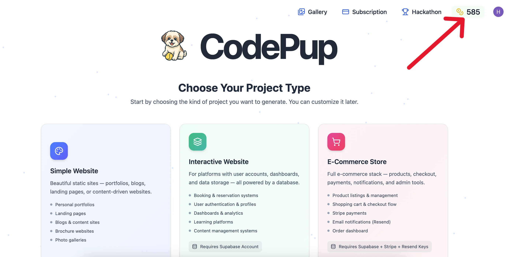

import { Card, Badge, Tabs, TabItem ,Aside } from '@astrojs/starlight/components';

Understanding plans, credit usage, and credit rollovers in CodePup AI

CodePup AI offers flexible subscription plans to match the needs of business owners, startups, product managers, MVP builders. Each plan provides access to powerful features and monthly credits that you can use for generation, modification, publishing, and exporting your projects.

When you use CodePup AI, every AI action consumes credits — giving you full control and transparency over your usage.

## Feature Comparison: Free vs. Paid Plans

<Tabs>
    <TabItem label="Free">  <Card title="Free" icon="approve-check">
        <ul>
            <Badge variant="note" text="Free of Cost" size="large" />
            <li>30 daily credits</li>
            <li>Generate & modify projects</li>
            <li>Publish projects</li>
            <li>Project Type: Public</li>
            <li>Support: Community</li>
        </ul>
    </Card>
    </TabItem>
    <TabItem label="Basic">  <Card title="Basic" icon="approve-check">
        <ul>
            <Badge variant="note" text="$25/month" size="large" />
            <li>30 daily credits</li>
            <li>100 total credits</li>
            <li>Generate & modify projects</li>
            <li>Publish projects</li>
            <li>Export Project Code to GitHub</li>
            <li>Project Type: Private</li>
            <li>Remove “Edit with CodePup” badge from published sites</li>
            <li>Support: Community</li>
        </ul>
        
    </Card>
    </TabItem>
    <TabItem label="Pro"> <Card title="Pro" icon="approve-check">
        <ul>
            <Badge variant="note" text="$50/month" size="large" />
            <li>30 daily credits</li>
            <li>220 total credits</li>
            <li>Generate & modify projects</li>
            <li>Publish projects</li>
            <li>Export Project Code to GitHub</li>
            <li>Project Type: Private</li>
            <li>Remove “Edit with CodePup” badge from published sites</li>
            <li>Support: Priority Email</li>
        </ul>
    </Card>
    </TabItem>
    <TabItem label="Advance">  <Card title="Advance" icon="approve-check">
        <ul>
            <Badge variant="note" text="$200/month" size="large" />
            <li>30 daily credits</li>
            <li>1100 total credits</li>
            <li>Generate & modify projects</li>
            <li>Publish projects</li>
            <li>Export Project Code to GitHub</li>
            <li>Project Type: Private</li>
            <li>Remove “Edit with CodePup” badge from published sites</li>
            <li>Support: Dedicated Support</li>
        </ul>
    </Card>
    </TabItem>

</Tabs>

 
## Available Paid Plans

| Plan | Monthly Credits | Monthly Billing | Annual Billing (Discounted) |
|------|------------------|-----------------|-----------------------------|
| **Basic** | 100 | $25 | $250 ($21/month) |
| **Pro** | 220 | $50 | $500 ($42/month) |
| **Advance** | 1,100 | $200 | $2,000 ($167/month) |

---

## Credit Usage

CodePup AI uses a **usage-based credit system**, ensuring you only spend credits for what you actually use.

| Action | Description | Credits Used | Availability |
|---------|--------------|---------------|---------------|
| **Generate** | Create new website sections, UI layouts, or components using AI | **15 credits** | All plans |
| **Modify** | Edit, update, or enhance existing designs or content | **5 credits** | All plans |
| **Publish** | Deploy and share your project instantly | **Free** | All plans |
| **Export to GitHub** | Push your generated project code directly to GitHub | **Free** | Paid plans only |

 
 
---

## Credit Display

You can easily track your **credit balance and usage** right inside the CodePup AI interface — no need to dig through settings.
- On the **dashboard (index page)**, your **total available credits** are shown at the **top-right corner** of the screen.

 

- When **building a project**, your **current credits** are also visible at the **top-right corner** of the editor — so you always know how many credits you have before generating or modifying anything.

Each time you perform an action (like **Generate** or **Modify**), your remaining credits update instantly.

---
## Credit Rollovers

Unused monthly credits **automatically roll over** at the end of your billing cycle, as long as your subscription remains active.
- **Monthly plans:** Rolled-over credits remain valid for **1 additional month**
- **Annual plans:** Rolled-over credits remain valid for the **entire duration** of your annual plan
Each time you perform an action (like **Generate** or **Modify**), your remaining credits update instantly.

---

## Upgrading or Downgrading

- You can upgrade instantly from your dashboard.  
- Downgrades take effect in the **next billing cycle**.  
- Your projects remain safe and accessible even if your subscription ends.

---

## Refund Policy

All payments are processed through third-party providers such as Stripe or Razorpay. Fees are non-refundable unless required by law. Paid Credits expire 2 months after purchase; free Credits expire at the end of their allocation.

---