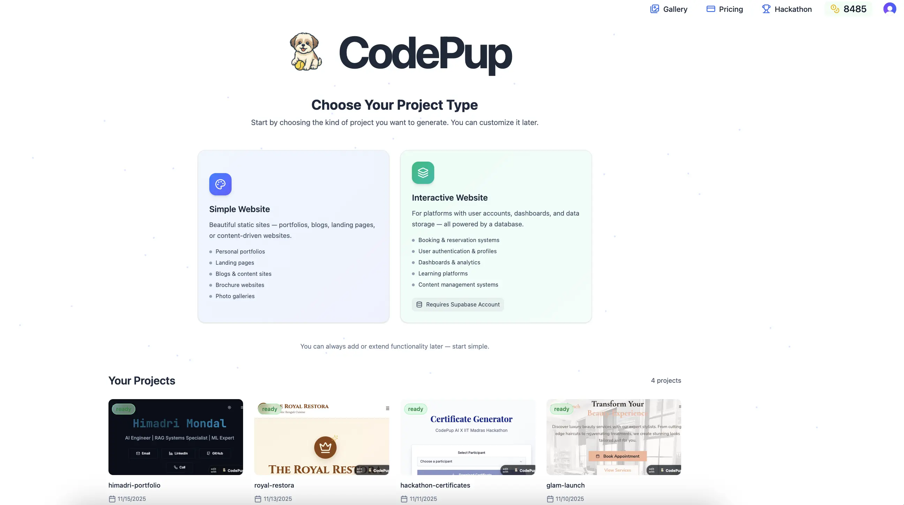

import { Steps, Badge ,Aside} from '@astrojs/starlight/components';

## Overview of CodePup AI

Welcome to CodePup AI, your no-code partner for building modern websites — from simple landing pages to full-stack web apps — all powered by AI.
Whether you’re a business owner, startup founder, developer, or product manager, CodePup helps you turn your idea into a live, functional website with just a few prompts.
The platform automatically generates layouts, code, and UI components so you can focus on your vision — not the syntax.

  

---

## Platform Overview

---

  
Create Your First Project

  <Steps>
    <ol>
      <li>Visit <strong>codepup.ai</strong> and sign in to your account.</li>

      <li>After signing in, you’ll land on the <strong>Index page</strong> where you can view or create projects.</li>

      <li>Choose the <strong>type of project</strong> you want to create — whether it’s a simple website or a full-stack application.</li>

      <li>
        <strong>Describe your website idea</strong> in plain English.

        <Aside type="tip" title="Example">
            “Create a landing page for a fitness coach with testimonials and a contact form.”
        </Aside>

      </li>

      <li>CodePup will instantly <strong>generate the full website</strong>, including structure, components, and responsive design.</li>
    </ol>
  </Steps>

---

  
Choosing a Project Type

#### Simple Website
Designed for frontend-only websites such as portfolios, landing pages, or blogs.  
Just describe what you want — CodePup automatically handles the design, layout, and responsiveness.

**Perfect for:**
- Personal portfolios  
- Business landing pages  
- Product showcases  
- Blog or content websites  

No database or backend required.

---

#### Interactive Website
Ideal for full-stack applications that include backend logic, user authentication, and database connectivity — powered by Supabase.

**Perfect for:**
- E-commerce platforms  
- Booking systems  
- Learning platforms  
- SaaS or CMS tools  

**Setup:**  
Before generating, enter your **Supabase Access Token** so CodePup can connect to your backend.  
Once linked, describe your idea — CodePup will generate a complete **frontend + backend** solution.

---

  
Your Projects Section

After signing in, scroll down to the **Your Projects** section — your workspace inside CodePup.

From here, you can:
- **Start a new project**
- **Open existing projects**
- **Check project status** (ready, in progress, generating)
- **Continue editing anytime**

Refine, expand, or redesign using simple chat instructions.

---

## Modify your project

---

  
Refine Through Chat

Type requests like **“Add a pricing section below the hero”** — CodePup applies changes instantly.

---

  
Add Components

Want polished UI components? Just describe them.

Example:  
“Add a pricing section with 4 pricing models below the hero.”

Or paste a component prompt from **any UI library (e.g., 21dev)** and say:  
_“Add this to my hero section.”_

CodePup integrates it automatically.

---

  
Version Control

CodePup’s upgraded **Version Control** makes it effortless to explore ideas without losing progress.

**Jump Back Anytime**  
Each project stores your **latest 20 versions**, letting you preview any older version and instantly revert to it.  
Want to try a different approach?  
Just switch to a previous version and continue building from there — your newer changes stay safe and can be reused anytime.

**Simple, Intuitive History**  
Your version timeline works just like Google Docs — easy to browse, easy to understand, and always in your control.

Click **Publish** to deploy the selected version instantly.

---

  
GitHub Export

Paid users can export generated code directly to GitHub.

Steps:
- Click the **GitHub logo** in your project chat.
- Select **Connect Project**.
- Rename the repository if needed.
- For later updates, click **Update [branch name]** — CodePup pushes changes automatically.

---

## Publish & Deploy

---

  
Preview and Publish

Preview instantly after generation.  
Click **Publish** anytime — your live link stays the same while new updates apply automatically.

---

  
Deploy Full-Stack Apps

For interactive projects, CodePup deploys **both frontend and backend**, giving you a live, database-connected web app in minutes.

---

  
Custom Domain <Badge text="Coming Soon" variant="note" />

You will soon be able to connect custom domains via:
- **GoDaddy**
- **Vercel**

Feature currently in development.  
Full setup guide coming soon.

