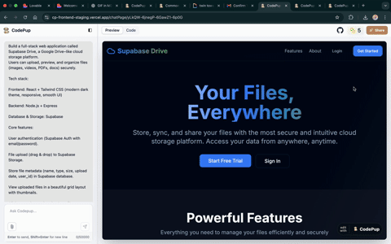

import { Aside, CardGrid, Card } from '@astrojs/starlight/components';

# Export to GitHub

We are introducing **GitHub Export**, a new way to securely store, version, and manage your generated projects outside CodePup AI.  
This release makes it easy to connect your GitHub account and push your project directly into a repository you control.

---

## What’s New

<Aside type="tip" title="Direct GitHub Integration">
Connect your GitHub account, choose a repository name, and export your project with a single click.
</Aside>

With this feature, you can:
- Authenticate using GitHub OAuth  
- View your username and avatar after connection  
- Provide a repository name (defaulted to your project’s name)  
- Export your project for the first time, or  
- Update the same repository when the project is modified  

This ensures your work remains accessible, auditable, and versioned—right in your GitHub workflow.

---

## Requirements

<Aside type="danger" title="Plan Requirement">
GitHub Export is available for paid plans only.  
Free-tier projects are not eligible for exporting.
</Aside>

---

## How It Works

### 1. Connect Your GitHub Account  
Click **Connect with GitHub** to authenticate your GitHub account.  
Once connected, your profile name and avatar will appear in the UI.

### 2. Choose Your Repository  
Set a repository name for your export.  
By default, we prefill this field with your current project name, but you may customize it.

### 3. Export or Update  
- **Initial Export:** Creates a new GitHub repository with your generated project.  
- **Subsequent Updates:** After modifying your project in CodePup AI, export again to update the **same repository**, ensuring continuity and version clarity.

---

## Why It Matters

<CardGrid>
  <Card title="Own Your Code" icon="laptop">
    Keep full control of your generated projects in your personal or organizational GitHub account.
  </Card>
  <Card title="Seamless Versioning" icon="github">
    Align CodePup’s generation workflow with GitHub’s version history and CI/CD pipelines.
  </Card>
  <Card title="Team Ready" icon="puzzle">
    Share your repository with collaborators, review changes, and onboard your team quickly.
  </Card>
</CardGrid>

---

## Looking Ahead

GitHub Export is the first step in deeper repository and CI integrations.  
Upcoming releases will enhance branch support, commit history visibility, and optional automatic deployment workflows.

Stay tuned for more improvements focused on giving you full ownership and workflow flexibility.
