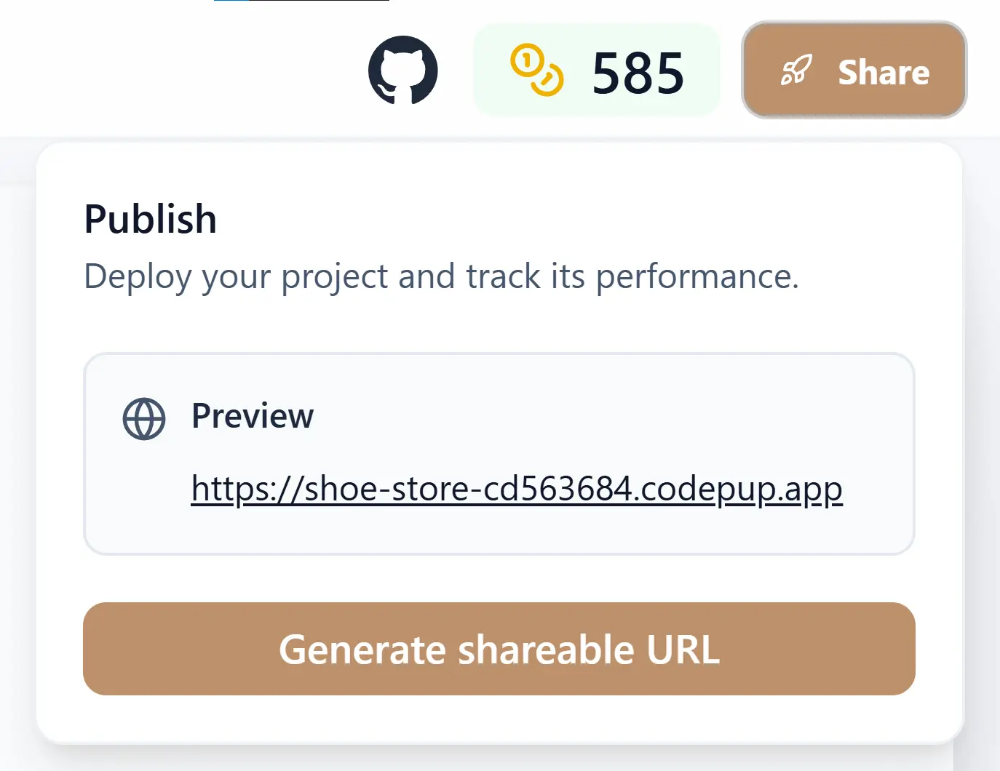

import { Aside, CardGrid, Card, Icon } from '@astrojs/starlight/components';

# Publish Your Project

After generating or modifying your app, you can **publish** it directly from the CodePup interface.  
Publishing makes your project accessible via a unique live URL that you can share instantly.

---

## Deployment Overview

Publishing is available once your project build is successful and the **preview** is visible.

The generated link follows this format:

{/* https://<project-name>-<unique-id>.codepup.app */}

Each project has its own dedicated subdomain that always points to the **latest deployment**.

---

## Continuous Updates

Whenever you modify and re-deploy your app:

- The same project URL remains active.  
- The new deployment automatically replaces the previous one.  
- Visitors will always see your **latest published version**.

This ensures stable links without version conflicts or duplicate URLs.

<Aside type="note" title="Single deployment URL">
  Each project maintains a single deployment address. Older builds are not accessible once a new deployment is published.
</Aside>

---

## How to Publish

1. Open your project in CodePup.  
2. Ensure your app preview is available and error-free.  
3. Click the **Share** button in the top-right corner.  
4. Click on **Generate shareable URL**.  
5. Copy the link and share it with anyone.

That's it — your live site is now accessible publicly.

---

## Future Enhancements

<CardGrid>
  <Card title="Custom Domains" icon="external">
    CodePup will soon allow you to connect your own custom domain for production-ready deployments.
  </Card>
  <Card title="Deployment Insights" icon="information">
    Track performance and view build history directly within your project dashboard.
  </Card>
</CardGrid>

---

CodePup simplifies the entire publishing workflow — from generation to deployment —  
so you can move from idea to live website within minutes.
