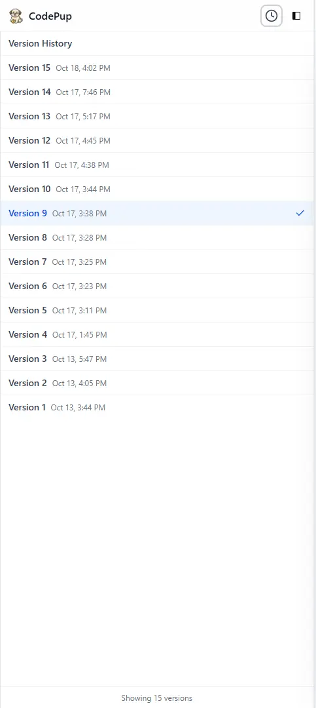

import { Aside, CardGrid, Card } from '@astrojs/starlight/components';

# 🚀 Version Control Arrives

We’re excited to introduce **Version Control** — a powerful way to explore, compare, and safely roll back your generated projects in **CodePup AI**.  
Now, every time you tweak your app, add components, or enhance code, we’ll automatically keep track of your changes for you.

---

## ✨ What’s New

<Aside type="tip" title="Automatic Version Snapshots">
Each project now maintains up to **20 recent versions**, captured seamlessly in the background as you build.
</Aside>

Every time you:
- Regenerate a section of your app,
- Apply code edits via prompts,
- Or attach new components or assets,

CodePup automatically saves that moment as a **restorable version** — no manual steps needed.

---

## 🕓 Restore Previous Versions

You can now **go back in time**.  
From your project dashboard, click the **clock icon** 🕓 in the top bar to open your version timeline.

You’ll see a list of previous states — simply pick one to instantly restore your project.

<Aside type="note" title="Frontend-Only (for now)">
Version Control currently supports **frontend-based projects**.  
Fullstack and backend versioning are on our roadmap.
</Aside>

---

## 📦 How It Helps

<CardGrid>
  <Card title="Safer Experimentation" icon="approve-check">
    Try bold edits or new features — you can always roll back to a previous snapshot.
  </Card>
  <Card title="Auto Cleanup" icon="pencil">
    CodePup keeps only your **latest 20 versions**, pruning older ones automatically to stay efficient.
  </Card>
  <Card title="Persistent Assets" icon="seti:lock">
    File uploads and custom assets stay safely stored, even when older versions are pruned.
  </Card>
</CardGrid>

---

## 🧭 Pro Tips

<CardGrid>
  <Card title="Export Regularly" icon="github">
    Sync your project with GitHub every few iterations — it’s the perfect pairing with in-app version control.
  </Card>
  <Card title="Iterate Forward" icon="random">
    When you restore a version, make your next edits *on top of it* — this keeps your context fresh and up to date.
  </Card>
</CardGrid>

---

## 🐾 Moving Forward

Version Control is a big step toward **safer creativity** in AI-assisted development.  
We want you to experiment freely, explore bold ideas, and never worry about losing your progress again.

> This is just the beginning — soon, fullstack and database versions will join the lineup.

Stay tuned, and keep building with confidence. 💡
